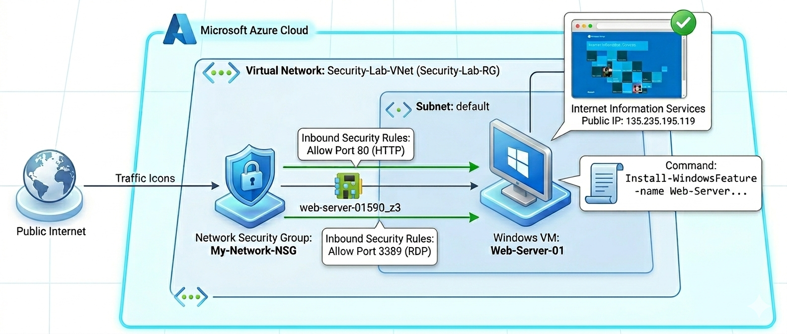
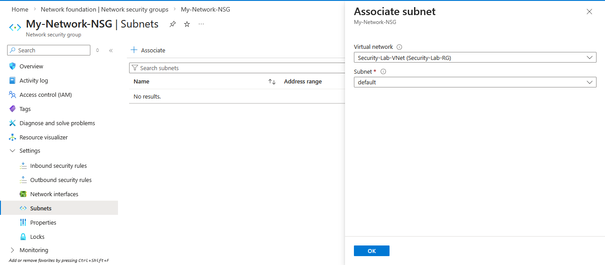
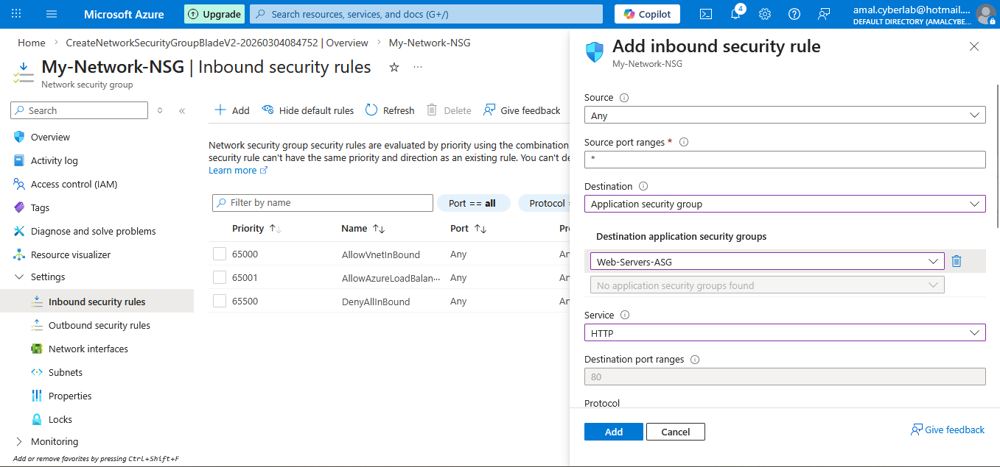
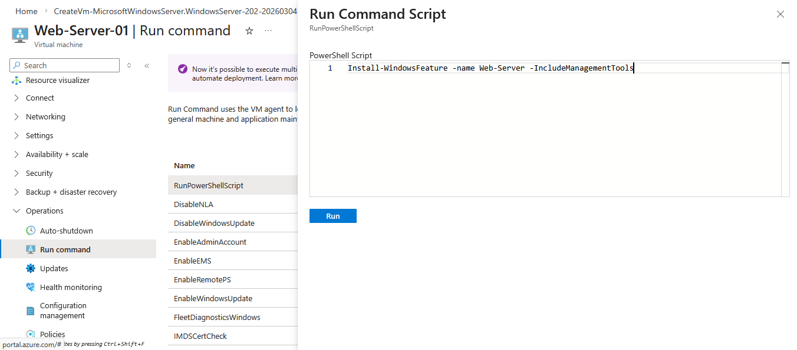
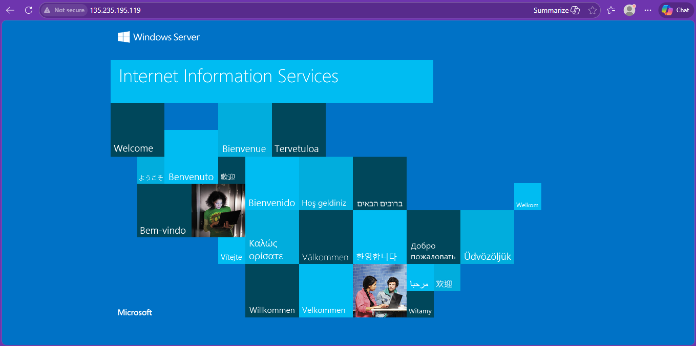
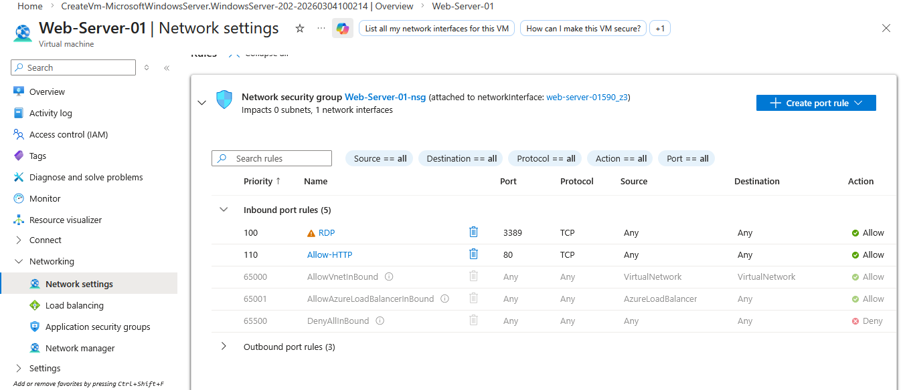

# Azure NSG + IIS Web Server Deployment Lab


---

## 📌 Overview

This hands-on lab demonstrates how to implement Network Security Groups (NSG) at subnet level and deploy a secure IIS Web Server in Microsoft Azure.

The lab validates inbound HTTP traffic (Port 80) while maintaining secure remote management using Azure Run Command.

Aligned with **AZ-500 – Implement Platform Protection & Secure Compute Resources**

---

## 🎯 Lab Objectives

- Create & associate Network Security Group (NSG) to subnet  
- Configure inbound HTTP rule (Port 80)  
- Deploy Windows Server VM  
- Install IIS using Azure Run Command (PowerShell)  
- Verify IIS default welcome page via Public IP  

---

## 🏗 High-Level Architecture



### Traffic Flow

1. Internet → HTTP (Port 80)  
2. Public IP  
3. Network Interface  
4. Windows Server VM (Web-Server-01)  
5. IIS Installed via Run Command  
6. IIS Welcome Page returned  

The NSG is enforced at subnet level to filter traffic before reaching the VM.

---

## 📸 Lab Evidence Gallery

### 1️⃣ NSG → Subnet Association



---

### 2️⃣ Adding Inbound HTTP Rule (Port 80)



Configuration:

- Source: Any  
- Destination: Application Security Group (Web-Servers-ASG)  
- Protocol: TCP  
- Port: 80  
- Priority: 110  

---

### 3️⃣ Run Command – Install IIS



PowerShell Command used:

```powershell
Install-WindowsFeature -Name Web-Server -IncludeManagementTools
```

Run Command enables secure execution without exposing RDP to the internet.

---

### 4️⃣ IIS Default Welcome Page Verification



Accessed via VM Public IP to confirm successful HTTP rule configuration.

---

### 5️⃣ VM Network Settings – NSG Attached



Confirms NSG association at network level.

---

## 🚀 Step-by-Step Implementation Summary

1. Created My-Network-NSG  
2. Associated NSG to default subnet in Security-LabVNet  
3. Added inbound rule to allow HTTP (Port 80)  
4. Deployed Windows Server VM (Web-Server-01)  
5. Installed IIS via Run Command  
6. Verified IIS page via Public IP  

---

## 🛡 Security Concepts Demonstrated

| Security Area | Implementation |
|--------------|---------------|
| Network Segmentation | Subnet-level NSG association |
| Access Control | Priority-based inbound rules |
| Secure Administration | Run Command instead of open RDP |
| Traffic Filtering | Port-based HTTP rule |
| Platform Protection | Secure VM workload |

---

## 🧠 Key Technical Takeaways

- NSG rules are evaluated by priority (lower number = higher priority)  
- Subnet-level NSG centralizes enforcement  
- Application Security Groups simplify rule targeting  
- Run Command reduces remote exposure risk  
- IIS deployment validates network security configuration  

---

## 🎓 AZ-500 Alignment

This lab supports:

- Implement Platform Protection  
- Secure Network Configuration  
- Configure Network Security Groups  
- Secure Compute Resources  
- Harden Azure VM workloads  

---

## ⭐ Support

If this lab helped your Azure security journey:

- Star ⭐ the repository  
- Fork and expand  
- Connect on LinkedIn  

---

Built by Amal Basnayake  
Cybersecurity Engineer | Cloud Security Enthusiast
